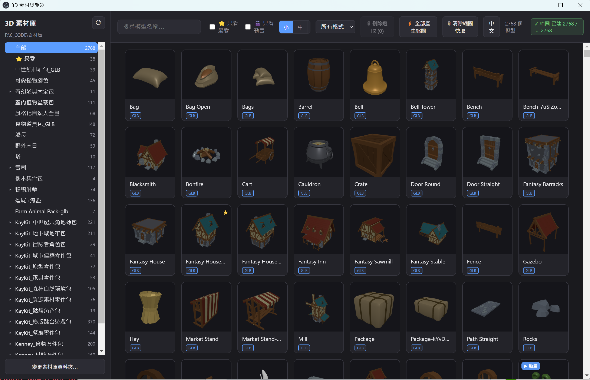
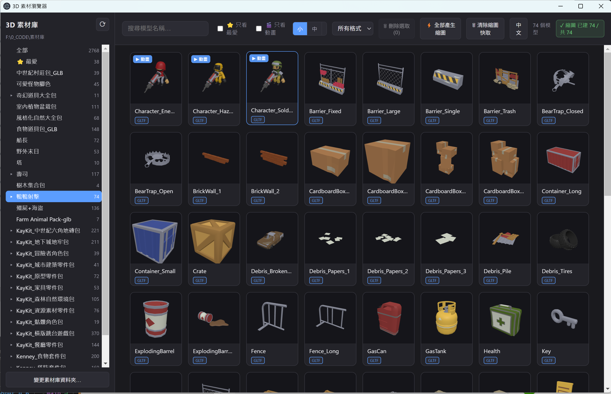

# 3D Asset Browser

A desktop app to browse local 3D asset libraries. Scan a folder, generate thumbnails, and view models in 3D with a single click. Supports both **English** and **中文** UI.


## Demo

[](https://youtu.be/PIGn0YEywX0)

## Screenshots





## Features

### Browsing
- Recursively scans a library folder; **same-name multi-format models** are merged into one card (glb / gltf / fbx / obj / blend)
- Sidebar folder tree; click a folder to filter to that directory
- Keyword search, format filter, favorites filter

### Thumbnails
- Thumbnails are rendered offline using three.js and **cached in a `.thumbs/` folder next to each model** — survives library moves
- IntersectionObserver **lazy loading**; only renders cards that enter the viewport
- `⚡ Build all thumbnails` button generates the full library in the background
- Three card sizes (S / M / L)

### Multi-select
- `Ctrl+click` to multi-select, `Shift+click` for range select
- Right-click menu: **List all paths**, Copy all paths, Open 3D viewer, Copy path, Open externally, Show in folder
- Batch delete (moves to Recycle Bin, recoverable)

### 3D Viewer
- Mouse rotate / zoom / pan; `Esc` to close
- Wireframe, grid, background (dark / light / transparent) toggle, reset view
- **Skeletal animation playback**: play, pause, switch clips (defaults to Idle)
- Shows triangle count, vertex count, all available format paths

## Quick Start

Default library path: `F:\0_CODE\素材庫` on Windows, `~/Documents/3D-Assets` on macOS/Linux.  
Change it in the app via the **"Change library folder…"** button, or edit `DEFAULT_LIBRARY_ROOT` in `electron/config.cjs`.

### Pre-built (Windows)

Download the latest installer from [Releases](https://github.com/craig7351/3d-asset-browser/releases).

### Development

```powershell
npm install
npm run dev      # Vite + Electron with hot reload; press F12 for DevTools
```

### Build

```powershell
npm run dist     # Outputs installers to release/
```

## Architecture

| Layer | Technology |
|-------|-----------|
| Desktop shell | Electron 33 |
| Frontend build | Vite 5 |
| 3D rendering | three.js r160 (GLTFLoader / FBXLoader / OBJLoader) |
| Main process | Node.js CJS (fs, path) |
| IPC | contextBridge + ipcMain.handle |
| i18n | Lightweight key-value strings in `src/i18n.js` |

**Thumbnail pipeline**: renderer uses an offscreen `WebGLRenderer` to snapshot each model → base64 PNG sent via IPC → saved as `{model_dir}/.thumbs/{stem}.png` → loaded instantly on subsequent opens.

**Scan pipeline**: main process uses `fs.promises` for async recursive scanning + `Promise.all` for parallel animation detection → results returned to renderer via IPC.

**Local HTTP server**: a read-only static server in Electron lets three.js resolve relative MTL / texture paths when loading OBJ files.

## Data locations

| Data | Location |
|------|----------|
| Thumbnails | `{model_dir}/.thumbs/{stem}.png` |
| Favorites / tags | `%APPDATA%\3D Asset Browser\library-data.json` |
| Library path setting | `%APPDATA%\3D Asset Browser\settings.json` |

---

# 中文說明

快速瀏覽本機 3D 素材庫的桌面工具，支援中英文 UI 切換。

[](https://youtu.be/PIGn0YEywX0)

## 功能

- 遞迴掃描素材庫，**同名多格式自動合併**成一個模型卡片（glb / gltf / fbx / obj / blend）
- 側欄資料夾樹導覽、關鍵字搜尋、格式 / 最愛篩選
- 縮圖存在**模型同目錄的 `.thumbs/`**，搬移素材庫不失效；`⚡ 全部產生縮圖` 可背景批次建立
- 多選（Ctrl / Shift）+ 右鍵選單：列出路徑、批次複製、批次刪除
- 3D 檢視器：旋轉 / 縮放、線框、格線、背景切換、骨架動畫播放

## 快速開始

```powershell
npm install
npm run dev   # 開發模式，支援熱更新
npm run dist  # 打包成各平台安裝檔
```

或直接從 [Releases](https://github.com/craig7351/3d-asset-browser/releases) 下載安裝檔。

## 資料位置

| 資料 | 路徑 |
|------|------|
| 縮圖 | `{模型目錄}/.thumbs/{模型名}.png` |
| 最愛 / 標記 | `%APPDATA%\3D Asset Browser\library-data.json` |
| 素材庫設定 | `%APPDATA%\3D Asset Browser\settings.json` |
